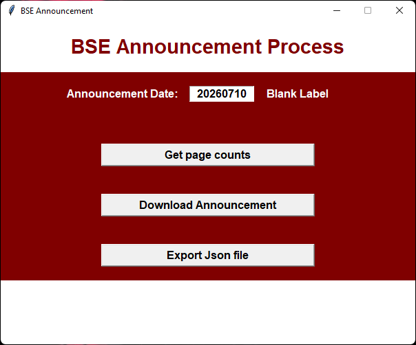
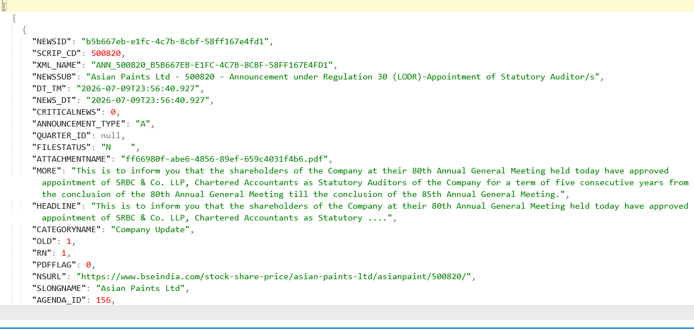

# 📈 BSE Announcement Downloader

A Python desktop application that automates the downloading of **BSE (Bombay Stock Exchange) Corporate Announcements** using the official BSE API and exports the data into a structured JSON file.

This application provides a simple graphical interface (Tkinter) for selecting an announcement date, retrieving announcement pages, downloading the records, and exporting them as JSON.

---

## 🚀 Features

- Download BSE Corporate Announcements
- Official BSE API Integration
- User-Friendly Tkinter GUI
- Automatic Page Count Detection
- Download All Announcement Pages
- Export Data to JSON
- Error Handling
- Fast & Lightweight

---

## 🛠 Technologies Used

- Python
- Tkinter
- Requests
- JSON
- Threading
- Pillow

---

## 📂 Project Structure

```text
bse-announcement-downloader/
│
├── screenshots/
│   ├── home.png
│   ├── download.png
│   └── output.png
│
├── sample_output/
│   └── sample_output.json
│
├── BSE_ANN_DATE.pyw
├── requirements.txt
├── README.md
├── LICENSE
└── .gitignore
```

---

## ⚙️ Installation

Clone the repository

```bash
git clone https://github.com/praveenkumardheeran/bse-announcement-downloader.git
```

Install dependencies

```bash
pip install -r requirements.txt
```

Run the application

```bash
python BSE_ANN_DATE.pyw
```

---

## 📸 Screenshots

### Home Screen



---

### Download Process


---

### JSON Output



---

## 🔄 Workflow

```text
Launch Application
        │
        ▼
Enter Announcement Date
        │
        ▼
Get Page Count
        │
        ▼
Download Announcements
        │
        ▼
Export to JSON
```

---

## 📄 Sample Output

```json
[
  {
    "SCRIP_CD": "500325",
    "SLONGNAME": "Reliance Industries Ltd",
    "CATEGORYNAME": "Company Update",
    "SUBCATNAME": "Board Meeting"
  }
]
```

---

## 💡 Future Improvements

- Export to Excel
- Search by Company Name
- Progress Bar
- CSV Export
- Automatic Daily Download
- Multi-Date Download
- Logging System

---

## 👨‍💻 Author

**Praveen Kumar**

📧 praveenkumardheeran@gmail.com

💼 https://www.linkedin.com/in/praveenkumardheeran

🌐 https://praveenkumardheeran.github.io/

---

## 📜 License

This project is licensed under the MIT License.

---

⭐ If you found this project useful, consider giving it a Star.
